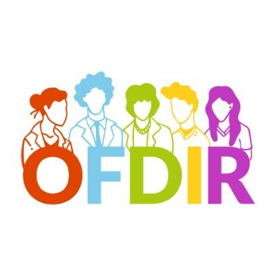

# OFDIR GitHub Pages Tutorial

This workshop is documented in a readthedocs.org site.  It has **Pages** on the left side, page level **Table of contents** on the right side, and a **Search bar** on the top right.

There is a glossary at the end for common terms used throughout the content.
 
## Workshop Agenda

1. *(5 min)* What are you hoping to learn today?
1. *(20 min x4)* 4 Lessons: lecture + hands-on + review
    - A Personal Website for Professional Outreach
    - Publishing a GitHub Page
    - The Magic of Markdown
    - Best Practices for Sharing Your Work
1. *(5 min)* Open Questions

## What are you hoping to learn today?

Let's take 5 minutes to discuss what you're hoping to learn today.

1. Introduce yourself
1. Talk about what you're hoping to learn from this workshop

## Attribution

This tutorial uses the [jekyll-academic template](https://github.com/NCSU-Libraries/jekyll-academic).

This template was developed by [NCSU Libraries](https://www.lib.ncsu.edu/) and is tailored specifically for use within the academic community.

## Acknowledgements

This workshop uses talking points and images originally developed in collaboration with [Letisha Wyatt, PhD](https://www.letisharwyatt.com), for the Impact Challenge workshop series developed by the OHSU Library.

Some of the content in this workshop was inspired by [Stacy Konkiel’s]( https://stacykonkiel.org/) work and instruction, most specifically her open access book the [30 Day Impact Challenge]( http://blog.impactstory.org/research-impact-challenge-ebook/). 

The gumball machine gif that appears in Lesson 4 was sourced from [Giphy]( https://giphy.com/) and created by [Anchor Point](https://www.anchorpoint.work/).  

The otter gif that appears in Lesson 4 was sourced from [Giphy]( https://giphy.com/) and created by [@Justin](https://giphy.com/justin/). 

